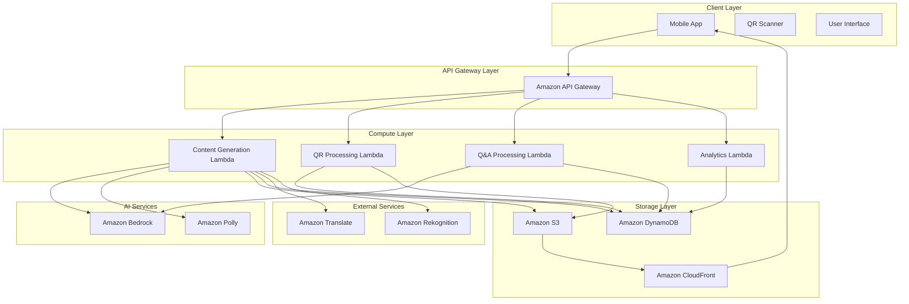

# Design Document: AvvarI for Bharat

## Overview

AvvarI for Bharat is a cloud-native, AI-powered heritage site digitization platform built on AWS services. The system transforms heritage site visits into immersive, multilingual experiences by combining QR code scanning, AI content generation, and real-time multimedia delivery. The architecture leverages Amazon Bedrock for AI capabilities, Amazon Polly for text-to-speech, AWS Lambda for serverless compute, DynamoDB for data storage, and S3 for content repository management.

The platform serves as a bridge between India's rich cultural heritage and modern digital experiences, making historical and architectural knowledge accessible to visitors in their native languages through audio guides, cinematic videos, and interactive infographics.

## Architecture

### High-Level Architecture



### Service Architecture

**API Gateway Layer:**
- Amazon API Gateway serves as the single entry point for all client requests
- Handles authentication, rate limiting, and request routing
- Provides REST endpoints for QR scanning, content generation, and Q&A interactions

**Compute Layer:**
- AWS Lambda functions provide serverless compute for all business logic
- Auto-scaling based on demand with sub-second cold start optimization
- Separate functions for content generation, QR processing, Q&A, and analytics

**AI Services Integration:**
- Amazon Bedrock provides foundation models for content generation and RAG-based Q&A
- Amazon Polly converts generated text to natural speech in multiple Indian languages
- Amazon Translate ensures accurate multilingual content generation
- Amazon Rekognition for image analysis and artifact identification

**Storage and Content Delivery:**
- Amazon S3 stores multimedia content, heritage site data, and generated assets
- Amazon DynamoDB provides low-latency data storage for user sessions, analytics, and cached content
- Amazon CloudFront ensures global content delivery with edge caching

## Components and Interfaces

### QR Scanner Component

**Purpose:** Captures and processes QR codes to identify heritage artifacts and initiate content generation.

**Interfaces:**
```typescript
interface QRScannerService {
  scanQRCode(imageData: ImageData): Promise<ArtifactIdentifier>
  validateQRCode(qrData: string): Promise<ValidationResult>
  getArtifactMetadata(artifactId: string): Promise<ArtifactMetadata>
}

interface ArtifactIdentifier {
  siteId: string
  artifactId: string
  location: GeoCoordinates
  timestamp: Date
}
```

**Implementation Details:**
- Uses device camera API for QR code capture
- Implements offline validation for previously scanned codes
- Maintains scan history in local storage
- Provides fallback manual entry for accessibility

### Content Generator Component

**Purpose:** Orchestrates AI-powered content creation using Amazon Bedrock and manages multimedia asset generation.

**Interfaces:**
```typescript
interface ContentGeneratorService {
  generateAudioGuide(artifactId: string, language: Language): Promise<AudioContent>
  generateVideo(artifactId: string, language: Language): Promise<VideoContent>
  generateInfographic(artifactId: string, language: Language): Promise<InfographicContent>
  getCachedContent(artifactId: string, contentType: ContentType, language: Language): Promise<Content | null>
}

interface ContentGenerationRequest {
  artifactId: string
  siteId: string
  language: Language
  contentTypes: ContentType[]
  userPreferences: UserPreferences
}
```

**Implementation Details:**
- Integrates with Amazon Bedrock for text generation using optimized prompts
- Uses Amazon Polly for multilingual text-to-speech conversion
- Implements intelligent caching strategy using DynamoDB
- Supports adaptive content quality based on network conditions

### RAG-Based Q&A System

**Purpose:** Provides intelligent question-answering capabilities using retrieval-augmented generation with Amazon Bedrock.

**Interfaces:**
```typescript
interface QAService {
  askQuestion(question: string, context: ArtifactContext, language: Language): Promise<QAResponse>
  getConversationHistory(sessionId: string): Promise<ConversationHistory>
  updateKnowledgeBase(siteId: string, content: HeritageContent): Promise<void>
}

interface QAResponse {
  answer: string
  confidence: number
  sources: ContentSource[]
  suggestedFollowUps: string[]
  language: Language
}
```

**Implementation Details:**
- Uses Amazon Bedrock's RAG capabilities with heritage-specific knowledge base
- Implements conversation context management for follow-up questions
- Provides source attribution for generated answers
- Supports multilingual question processing and response generation

### Audio Guide System

**Purpose:** Manages multilingual audio content generation and playback functionality.

**Interfaces:**
```typescript
interface AudioGuideService {
  generateNarration(content: string, language: Language, voice: VoiceProfile): Promise<AudioFile>
  getAvailableVoices(language: Language): Promise<VoiceProfile[]>
  optimizeAudioForMobile(audioFile: AudioFile): Promise<AudioFile>
}

interface AudioPlaybackController {
  play(audioFile: AudioFile): Promise<void>
  pause(): void
  setPlaybackSpeed(speed: number): void
  setVolume(volume: number): void
}
```

**Implementation Details:**
- Leverages Amazon Polly's neural voices for natural speech generation
- Supports 10+ Indian languages with culturally appropriate voice profiles
- Implements audio compression and optimization for mobile delivery
- Provides accessibility features including speed control and volume adjustment

### Content Repository Manager

**Purpose:** Manages heritage site content, multimedia assets, and implements efficient content distribution.

**Interfaces:**
```typescript
interface ContentRepositoryService {
  storeContent(content: MultimediaContent, metadata: ContentMetadata): Promise<string>
  retrieveContent(contentId: string, language: Language): Promise<MultimediaContent>
  updateContent(contentId: string, updates: ContentUpdates): Promise<void>
  deleteContent(contentId: string): Promise<void>
  listContentBySite(siteId: string): Promise<ContentSummary[]>
}

interface ContentMetadata {
  siteId: string
  artifactId: string
  contentType: ContentType
  language: Language
  version: string
  createdAt: Date
  updatedAt: Date
  tags: string[]
}
```

**Implementation Details:**
- Uses S3 for scalable multimedia content storage
- Implements CloudFront for global content delivery and caching
- Supports content versioning and rollback capabilities
- Provides efficient content organization by site, artifact, and language

## Data Models

### Heritage Site Model

```typescript
interface HeritageSite {
  siteId: string
  name: string
  location: GeoCoordinates
  description: string
  historicalPeriod: string
  culturalSignificance: string
  artifacts: ArtifactReference[]
  supportedLanguages: Language[]
  metadata: SiteMetadata
}

interface ArtifactReference {
  artifactId: string
  name: string
  type: ArtifactType
  location: RelativeCoordinates
  qrCodeData: string
  description: string
}
```

### Content Model

```typescript
interface MultimediaContent {
  contentId: string
  artifactId: string
  contentType: ContentType
  language: Language
  data: ContentData
  metadata: ContentMetadata
  cacheSettings: CacheConfiguration
}

interface ContentData {
  text?: string
  audioUrl?: string
  videoUrl?: string
  infographicData?: InfographicData
  duration?: number
  fileSize?: number
}
```

### User Session Model

```typescript
interface UserSession {
  sessionId: string
  userId?: string
  siteId: string
  preferredLanguage: Language
  visitStartTime: Date
  scannedArtifacts: string[]
  contentInteractions: ContentInteraction[]
  conversationHistory: QAInteraction[]
  preferences: UserPreferences
}

interface ContentInteraction {
  contentId: string
  interactionType: InteractionType
  timestamp: Date
  duration?: number
  completionPercentage?: number
}
```

### Analytics Model

```typescript
interface AnalyticsEvent {
  eventId: string
  sessionId: string
  eventType: EventType
  timestamp: Date
  siteId: string
  artifactId?: string
  language: Language
  metadata: EventMetadata
}

interface UsageMetrics {
  siteId: string
  date: Date
  totalVisitors: number
  qrScansCount: number
  contentGenerations: number
  languageDistribution: LanguageStats[]
  popularArtifacts: ArtifactStats[]
  averageSessionDuration: number
}
```

## Correctness Properties

*A property is a characteristic or behavior that should hold true across all valid executions of a system—essentially, a formal statement about what the system should do. Properties serve as the bridge between human-readable specifications and machine-verifiable correctness guarantees.*

### Property Reflection

After analyzing all acceptance criteria, several properties can be consolidated to eliminate redundancy:

- Language consistency properties (2.2, 2.5, 3.2, 4.3, 5.3, 6.3) can be combined into a comprehensive multilingual consistency property
- Performance properties (1.3, 7.1) both test 3-second response times and can be unified
- Caching properties (7.3, 10.1, 10.2) test different aspects of the same caching system and can be consolidated
- Content generation properties using Amazon Bedrock (3.1, 6.1, 7.2) can be combined into a single comprehensive property

### Core Properties

**Property 1: QR Code Processing Accuracy**
*For any* valid heritage site QR code containing artifact identifier data, scanning should successfully decode the artifact identifier and initiate content retrieval within the system
**Validates: Requirements 1.1**

**Property 2: Invalid Input Handling**
*For any* invalid, corrupted, or malformed QR code input, the system should gracefully handle the error by displaying appropriate error messages and providing alternative access methods
**Validates: Requirements 1.2**

**Property 3: Performance Guarantee**
*For any* successful QR code scan or content request, the system should deliver multimedia content within 3 seconds of the initial request
**Validates: Requirements 1.3, 7.1**

**Property 4: Session State Consistency**
*For any* sequence of QR code scans within a user session, all scanned artifacts should be maintained in the session history and remain accessible throughout the session
**Validates: Requirements 1.4**

**Property 5: Multilingual Content Consistency**
*For any* user-selected language and any content generation request, all generated content (audio, video, infographics, Q&A responses) should be consistently delivered in the selected language
**Validates: Requirements 2.2, 2.5, 3.2, 4.3, 5.3, 6.3**

**Property 6: Language Fallback Behavior**
*For any* content request in an unsupported or unavailable language, the system should provide content in Hindi or English with appropriate notification to the user
**Validates: Requirements 2.4**

**Property 7: Audio Guide Generation**
*For any* artifact content request, the system should generate contextual audio narration using Amazon Bedrock and convert it to speech using Amazon Polly in the user's selected language
**Validates: Requirements 3.1, 3.2**

**Property 8: Audio Playback Controls**
*For any* generated audio content, the system should provide functional playback controls including play, pause, rewind, and speed adjustment capabilities
**Validates: Requirements 3.4**

**Property 9: Audio Generation Fallback**
*For any* audio generation failure, the system should provide the same content in text format as a fallback mechanism
**Validates: Requirements 3.5**

**Property 10: Video Quality Standards**
*For any* video content generation request, the system should produce videos with minimum 720p resolution optimized for mobile viewing
**Validates: Requirements 4.2**

**Property 11: Adaptive Video Streaming**
*For any* network bandwidth condition, the system should adapt video quality streaming to match available bandwidth while maintaining playback continuity
**Validates: Requirements 4.5**

**Property 12: Infographic Content Completeness**
*For any* infographic generation request, the system should create interactive content including timelines, architectural diagrams, and historical maps with touch-interactive elements
**Validates: Requirements 5.1, 5.2**

**Property 13: Architectural Information Completeness**
*For any* architectural artifact, generated infographic content should include measurements, construction techniques, and historical period information
**Validates: Requirements 5.4**

**Property 14: RAG-Based Question Answering**
*For any* visitor question about heritage sites, the RAG system should use Amazon Bedrock to retrieve relevant information and generate contextually appropriate responses
**Validates: Requirements 6.1, 6.2**

**Property 15: Unanswerable Question Handling**
*For any* question that cannot be answered from the available knowledge base, the system should acknowledge its limitations and suggest related topics
**Validates: Requirements 6.4**

**Property 16: Conversation Context Maintenance**
*For any* follow-up question within an interactive session, the system should maintain conversation context and provide responses that reference previous interactions
**Validates: Requirements 6.5**

**Property 17: Content Caching Efficiency**
*For any* frequently accessed content, the system should implement DynamoDB caching mechanisms that reduce response times for subsequent requests
**Validates: Requirements 7.3**

**Property 18: Network-Aware Content Delivery**
*For any* poor network connectivity condition, the system should prioritize essential content delivery and provide appropriate loading feedback
**Validates: Requirements 7.4**

**Property 19: Content Organization Structure**
*For any* content stored in the repository, it should be organized by heritage site, artifact type, and language using consistent S3 bucket structures
**Validates: Requirements 8.1**

**Property 20: System Extensibility**
*For any* new heritage site addition, the system should support site-specific content generation without requiring system modifications or code changes
**Validates: Requirements 8.2**

**Property 21: Concurrent User Scalability**
*For any* number of concurrent users across multiple heritage sites, the system should handle requests using AWS Lambda auto-scaling without performance degradation
**Validates: Requirements 8.3**

**Property 22: Global Content Distribution**
*For any* content request, the system should serve content through CloudFront for efficient global access and reduced latency
**Validates: Requirements 8.5**

**Property 23: Accessibility Audio Descriptions**
*For any* visual content including videos and infographics, the system should generate audio descriptions for accessibility compliance
**Validates: Requirements 9.2**

**Property 24: Audio Accessibility Controls**
*For any* audio content, the system should provide adjustable playback speed and volume controls for hearing accessibility
**Validates: Requirements 9.3**

**Property 25: Visual Accessibility Options**
*For any* user interface element, the system should support high contrast modes and large text options for visual accessibility
**Validates: Requirements 9.5**

**Property 26: Offline Content Caching**
*For any* heritage site visit, the system should cache essential content locally for offline access after the initial visit
**Validates: Requirements 10.1**

**Property 27: Offline Functionality**
*For any* offline condition, the system should provide access to previously cached audio guides, basic information, and QR scanning for cached artifacts
**Validates: Requirements 10.2, 10.3**

**Property 28: Content Synchronization**
*For any* connectivity restoration after offline period, the system should sync new content and update cached information automatically
**Validates: Requirements 10.4**

**Property 29: Intelligent Cache Prioritization**
*For any* content caching decision, the system should prioritize critical content based on visitor patterns and usage analytics
**Validates: Requirements 10.5**

**Property 30: Content Versioning**
*For any* content update in the repository, the system should maintain version history and support rollback capabilities
**Validates: Requirements 11.1**

**Property 31: Cache Invalidation**
*For any* content update, the system should refresh cached content across all distribution points to ensure consistency
**Validates: Requirements 11.2**

**Property 32: Audit Trail Maintenance**
*For any* content management operation, the system should maintain comprehensive audit trails recording all changes with timestamps and user information
**Validates: Requirements 11.4**

**Property 33: Bulk Update Support**
*For any* site-wide content change, the system should support bulk updates that efficiently modify multiple content items simultaneously
**Validates: Requirements 11.5**

**Property 34: Analytics Data Collection**
*For any* user interaction including QR scans, content views, and engagement patterns, the system should record analytics data in DynamoDB
**Validates: Requirements 12.1**

**Property 35: User Preference Analytics**
*For any* visitor content interaction, the system should record language preferences and content type engagement for analytics purposes
**Validates: Requirements 12.2**

**Property 36: Usage Report Generation**
*For any* analytics data collection period, the system should generate comprehensive usage reports for heritage site administrators
**Validates: Requirements 12.3**

**Property 37: Real-time Dashboard Updates**
*For any* system performance metric or user engagement data, the system should provide real-time dashboard updates for monitoring purposes
**Validates: Requirements 12.5**

## Error Handling

### Error Categories and Handling Strategies

**QR Code Processing Errors:**
- Invalid QR code format: Display user-friendly error message with manual entry option
- Corrupted QR data: Implement error correction algorithms and fallback to manual entry
- Camera access denied: Provide alternative input methods and clear permission instructions
- Network timeout during artifact lookup: Cache artifact metadata for offline validation

**Content Generation Errors:**
- Amazon Bedrock API failures: Implement exponential backoff retry logic with circuit breaker pattern
- Amazon Polly service unavailable: Fallback to text-based content with notification
- Content generation timeout: Provide partial content with loading indicators
- Language model hallucination: Implement content validation and fact-checking mechanisms

**Storage and Retrieval Errors:**
- S3 service unavailable: Serve content from CloudFront cache or local storage
- DynamoDB throttling: Implement request queuing and exponential backoff
- Cache miss scenarios: Generate content on-demand with appropriate loading feedback
- Content corruption: Validate content integrity and regenerate if necessary

**Network and Connectivity Errors:**
- Poor network conditions: Implement adaptive content quality and progressive loading
- Complete network failure: Switch to offline mode with cached content
- API Gateway timeouts: Implement client-side retry logic with exponential backoff
- CloudFront edge failures: Fallback to origin server with degraded performance notification

**User Experience Error Handling:**
- Accessibility feature failures: Provide alternative interaction methods
- Audio playback errors: Offer text alternatives and troubleshooting guidance
- Video streaming failures: Implement adaptive bitrate streaming and quality fallback
- Session timeout: Gracefully handle session restoration and state recovery

### Error Recovery Mechanisms

**Graceful Degradation:**
- Content quality reduction under network constraints
- Feature-specific fallbacks (audio to text, video to images)
- Progressive enhancement based on device capabilities
- Offline mode with essential functionality preservation

**Retry Strategies:**
- Exponential backoff for transient failures
- Circuit breaker pattern for service protection
- Request queuing for rate-limited services
- Intelligent retry based on error type classification

**User Communication:**
- Clear, actionable error messages in user's preferred language
- Progress indicators during error recovery attempts
- Alternative action suggestions when primary features fail
- Proactive notification of service restoration

## Testing Strategy

### Dual Testing Approach

The testing strategy employs both unit testing and property-based testing as complementary approaches to ensure comprehensive coverage and system correctness.

**Unit Testing Focus:**
- Specific examples demonstrating correct behavior for each component
- Edge cases and boundary conditions for input validation
- Error conditions and exception handling scenarios
- Integration points between AWS services and application components
- Mock-based testing for external service dependencies

**Property-Based Testing Focus:**
- Universal properties that hold across all valid inputs
- Comprehensive input coverage through randomization
- Correctness validation for AI-generated content
- Performance characteristics under various load conditions
- Data consistency across distributed system components

### Property-Based Testing Configuration

**Testing Framework:** 
- **Python**: Use Hypothesis library for property-based testing
- **TypeScript/JavaScript**: Use fast-check library for property-based testing
- **Java**: Use jqwik library for property-based testing

**Test Configuration Requirements:**
- Minimum 100 iterations per property test to ensure statistical significance
- Each property test must reference its corresponding design document property
- Tag format: **Feature: avvari-for-bharat, Property {number}: {property_text}**
- Seed-based randomization for reproducible test failures
- Shrinking capabilities to find minimal failing examples

**Property Test Implementation Guidelines:**
- Each correctness property must be implemented by exactly one property-based test
- Generate realistic test data that mirrors production heritage site content
- Include edge cases in generators (empty strings, maximum lengths, special characters)
- Test multilingual scenarios with various Indian language combinations
- Validate AWS service integration through property tests with mocked responses

### Integration Testing Strategy

**AWS Service Integration:**
- Test Amazon Bedrock integration with heritage-specific prompts
- Validate Amazon Polly voice generation across supported languages
- Verify S3 content storage and retrieval with CloudFront distribution
- Test DynamoDB caching mechanisms under concurrent access patterns
- Validate API Gateway routing and Lambda function invocation

**End-to-End Testing:**
- Complete user journey from QR scan to content consumption
- Multilingual content generation and delivery workflows
- Offline-to-online synchronization scenarios
- Cross-device compatibility and responsive design validation
- Performance testing under realistic load conditions

**Accessibility Testing:**
- Screen reader compatibility validation
- Voice navigation functionality testing
- High contrast and large text mode verification
- Audio description accuracy and synchronization
- Keyboard navigation and alternative input method support

### Performance Testing Requirements

**Load Testing:**
- Simulate concurrent users across multiple heritage sites
- Test AWS Lambda auto-scaling under varying load patterns
- Validate CloudFront cache performance and hit ratios
- Measure content generation latency under peak usage
- Test database performance with realistic query patterns

**Performance Benchmarks:**
- Content delivery within 3 seconds for 95% of requests
- QR code processing within 1 second for valid codes
- Audio generation within 5 seconds for standard content
- Video streaming startup within 2 seconds
- Offline content access within 500ms

### Continuous Testing Pipeline

**Automated Testing Integration:**
- Property-based tests in CI/CD pipeline with failure analysis
- Performance regression testing on each deployment
- Accessibility compliance validation in automated builds
- Security testing for AWS service configurations
- Content quality validation for AI-generated materials

**Monitoring and Alerting:**
- Real-time performance monitoring with CloudWatch metrics
- Error rate tracking and anomaly detection
- User experience monitoring through synthetic transactions
- Content generation quality metrics and drift detection
- System health dashboards for operational visibility