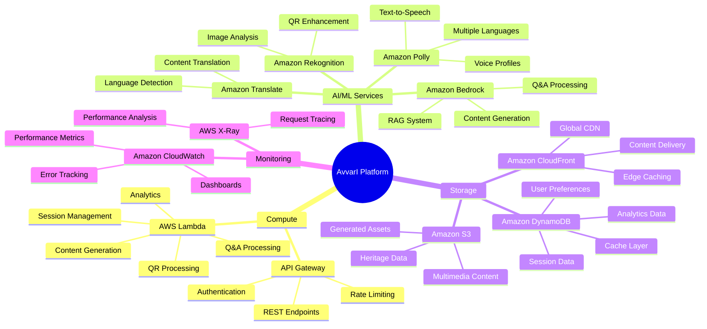

# AvvarI for Bharat - AWS Architecture Diagram

## AWS Cloud Architecture

```mermaid
graph TB
    subgraph Internet["🌐 Internet"]
        Users["� Heritage Site Visitors<br/>Mobile Devices"]
    end
    
    subgraph AWS["☁️ AWS Cloud"]
        subgraph Edge["🌍 Global Edge Network"]
            CloudFront["Amazon CloudFront<br/>Global CDN<br/>Edge Caching"]
            WAF["AWS WAF<br/>Web Application Firewall<br/>DDoS Protection"]
        end
        
        subgraph Region["🏢 AWS Region (ap-south-1)"]
            subgraph AZ1["📍 Availability Zone 1a"]
                APIGateway["Amazon API Gateway<br/>REST API Endpoints<br/>Authentication & Rate Limiting"]
                Lambda1["AWS Lambda<br/>QR Processing<br/>Content Generation"]
                DynamoDB1["Amazon DynamoDB<br/>Session Data<br/>Cache Layer"]
            end
            
            subgraph AZ2["📍 Availability Zone 1b"]
                Lambda2["AWS Lambda<br/>Q&A Processing<br/>Analytics"]
                S3["Amazon S3<br/>Multimedia Content<br/>Heritage Data<br/>Generated Assets"]
                DynamoDB2["Amazon DynamoDB<br/>Cross-AZ Replication<br/>High Availability"]
            end
            
            subgraph AIServices["🤖 AI/ML Services"]
                Bedrock["Amazon Bedrock<br/>Foundation Models<br/>Content Generation<br/>RAG System"]
                Polly["Amazon Polly<br/>Text-to-Speech<br/>Neural Voices<br/>10+ Indian Languages"]
                Translate["Amazon Translate<br/>Language Detection<br/>Real-time Translation"]
                Rekognition["Amazon Rekognition<br/>Image Analysis<br/>QR Enhancement"]
            end
            
            subgraph Monitoring["📊 Monitoring & Analytics"]
                CloudWatch["Amazon CloudWatch<br/>Metrics & Logs<br/>Performance Monitoring"]
                XRay["AWS X-Ray<br/>Distributed Tracing<br/>Performance Analysis"]
            end
        end
    end
    
    %% Connections with numbered flow
    Users -->|"1. HTTPS Request"| WAF
    WAF -->|"2. Security Check"| CloudFront
    CloudFront -->|"3. Cache Miss"| APIGateway
    CloudFront -->|"3a. Cache Hit"| Users
    
    APIGateway -->|"4. Route Request"| Lambda1
    APIGateway -->|"4. Route Request"| Lambda2
    
    Lambda1 -->|"5. Store Session"| DynamoDB1
    Lambda1 -->|"6. Generate Content"| Bedrock
    Lambda1 -->|"7. Text-to-Speech"| Polly
    Lambda1 -->|"8. Translate"| Translate
    Lambda1 -->|"9. Image Analysis"| Rekognition
    
    Lambda2 -->|"5. Q&A Processing"| Bedrock
    Lambda2 -->|"5. Store Analytics"| DynamoDB2
    
    Lambda1 -->|"10. Store Content"| S3
    Lambda2 -->|"10. Store Content"| S3
    
    S3 -->|"11. Origin Pull"| CloudFront
    DynamoDB1 -.->|"Replication"| DynamoDB2
    
    Lambda1 -->|"Metrics"| CloudWatch
    Lambda2 -->|"Metrics"| CloudWatch
    Lambda1 -->|"Traces"| XRay
    Lambda2 -->|"Traces"| XRay
    
    CloudFront -->|"12. Content Delivery"| Users
    
    %% Styling
    classDef internet fill:#e3f2fd,stroke:#1976d2,stroke-width:2px
    classDef edge fill:#f3e5f5,stroke:#7b1fa2,stroke-width:2px
    classDef compute fill:#e8f5e8,stroke:#388e3c,stroke-width:2px
    classDef storage fill:#fff3e0,stroke:#f57c00,stroke-width:2px
    classDef ai fill:#fce4ec,stroke:#c2185b,stroke-width:2px
    classDef monitor fill:#f1f8e9,stroke:#689f38,stroke-width:2px
    
    class Users internet
    class CloudFront,WAF edge
    class APIGateway,Lambda1,Lambda2 compute
    class S3,DynamoDB1,DynamoDB2 storage
    class Bedrock,Polly,Translate,Rekognition ai
    class CloudWatch,XRay monitor
```

## Detailed Component Architecture

```mermaid
graph LR
    subgraph Client["� Client Layer"]
        MobileApp["Mobile Application<br/>• QR Scanner<br/>• Audio Player<br/>• Video Player<br/>• UI Components"]
    end
    
    subgraph CDN["� Content Delivery Network"]
        CF["Amazon CloudFront<br/>• Global Edge Locations<br/>• Static Content Caching<br/>• Dynamic Content Acceleration"]
        Shield["AWS Shield<br/>• DDoS Protection<br/>• Always-On Detection"]
    end
    
    subgraph Gateway["� API Gateway"]
        APIGW["Amazon API Gateway<br/>• REST API Endpoints<br/>• Request Validation<br/>• Rate Limiting<br/>• CORS Handling"]
        Auth["Authentication<br/>• JWT Tokens<br/>• Session Management<br/>• Access Control"]
    end
    
    subgraph Compute["⚙️ Serverless Compute"]
        QRFunc["QR Processing Function<br/>• Code Validation<br/>• Artifact Identification<br/>• Session Creation"]
        ContentFunc["Content Generation Function<br/>• AI Content Creation<br/>• Multimedia Processing<br/>• Cache Management"]
        QAFunc["Q&A Function<br/>• RAG Processing<br/>• Context Management<br/>• Response Generation"]
        AnalyticsFunc["Analytics Function<br/>• Event Tracking<br/>• Usage Metrics<br/>• Report Generation"]
    end
    
    subgraph AI["🤖 AI Services"]
        BedrockService["Amazon Bedrock<br/>• Claude/Llama Models<br/>• Content Generation<br/>• RAG Implementation<br/>• Knowledge Base"]
        PollyService["Amazon Polly<br/>• Neural TTS<br/>• Indian Language Voices<br/>• SSML Support"]
        TranslateService["Amazon Translate<br/>• Real-time Translation<br/>• Language Detection<br/>• Cultural Context"]
    end
    
    subgraph Storage["💾 Storage Layer"]
        S3Bucket["Amazon S3<br/>• Multimedia Content<br/>• Heritage Data<br/>• Generated Assets<br/>• Backup Storage"]
        DynamoTable["Amazon DynamoDB<br/>• Session Data<br/>• User Preferences<br/>• Analytics Events<br/>• Cache Layer"]
    end
    
    subgraph Monitor["📊 Monitoring"]
        CW["CloudWatch<br/>• Metrics Collection<br/>• Log Aggregation<br/>• Alerting<br/>• Dashboards"]
        XRayService["X-Ray<br/>• Request Tracing<br/>• Performance Analysis<br/>• Error Detection"]
    end
    
    %% Connections
    MobileApp <--> CF
    CF <--> Shield
    Shield <--> APIGW
    APIGW <--> Auth
    
    APIGW --> QRFunc
    APIGW --> ContentFunc
    APIGW --> QAFunc
    APIGW --> AnalyticsFunc
    
    ContentFunc --> BedrockService
    ContentFunc --> PollyService
    ContentFunc --> TranslateService
    QAFunc --> BedrockService
    
    QRFunc --> DynamoTable
    ContentFunc --> S3Bucket
    ContentFunc --> DynamoTable
    QAFunc --> DynamoTable
    AnalyticsFunc --> DynamoTable
    
    S3Bucket --> CF
    
    QRFunc --> CW
    ContentFunc --> CW
    QAFunc --> CW
    AnalyticsFunc --> CW
    
    QRFunc --> XRayService
    ContentFunc --> XRayService
    QAFunc --> XRayService
    AnalyticsFunc --> XRayService
```

## Data Flow Sequence

```mermaid
sequenceDiagram
    participant U as 👤 User
    participant M as 📱 Mobile App
    participant CF as 🌐 CloudFront
    participant AG as 🚪 API Gateway
    participant L1 as ⚙️ QR Lambda
    participant L2 as 🎨 Content Lambda
    participant BR as 🤖 Bedrock
    participant PL as 🗣️ Polly
    participant S3 as 💾 S3
    participant DB as ⚡ DynamoDB
    
    Note over U,DB: Heritage Site Visit Flow
    
    U->>M: Scan QR Code
    M->>AG: POST /api/scan-qr
    AG->>L1: Invoke QR Processing
    L1->>DB: Validate & Create Session
    L1-->>AG: Session ID + Artifact ID
    AG-->>M: QR Scan Success
    
    M->>AG: GET /api/content/{artifactId}
    AG->>L2: Invoke Content Generation
    L2->>DB: Check Content Cache
    
    alt Content Not Cached
        L2->>BR: Generate Heritage Content
        BR-->>L2: Generated Text Content
        L2->>PL: Convert Text to Speech
        PL-->>L2: Audio File
        L2->>S3: Store Multimedia Content
        L2->>DB: Cache Content Metadata
    else Content Cached
        L2->>DB: Retrieve Cache Info
        L2->>S3: Get Cached Content URLs
    end
    
    L2-->>AG: Content URLs & Metadata
    AG-->>M: Content Response
    M->>CF: Request Audio/Video Files
    CF-->>M: Deliver Multimedia Content
    M-->>U: Play Audio Guide & Display Content
    
    Note over U,DB: Interactive Q&A Flow
    
    U->>M: Ask Question about Artifact
    M->>AG: POST /api/qa
    AG->>L2: Invoke Q&A Processing
    L2->>BR: RAG Query with Context
    BR-->>L2: Generated Answer
    L2->>DB: Store Q&A Interaction
    L2-->>AG: Answer Response
    AG-->>M: Formatted Answer
    M-->>U: Display Answer
```

## Security Architecture

```mermaid
graph TB
    subgraph Internet["🌐 Internet"]
        Threats["⚠️ Security Threats<br/>• DDoS Attacks<br/>• Malicious Requests<br/>• Data Breaches"]
    end
    
    subgraph Security["🛡️ Security Layer"]
        Shield["AWS Shield Standard<br/>• DDoS Protection<br/>• Network Layer Defense"]
        WAF["AWS WAF<br/>• Application Layer Firewall<br/>• Custom Rules<br/>• Rate Limiting"]
        CloudTrail["AWS CloudTrail<br/>• API Call Logging<br/>• Audit Trail<br/>• Compliance"]
    end
    
    subgraph Access["🔐 Access Control"]
        IAM["AWS IAM<br/>• Role-Based Access<br/>• Least Privilege<br/>• Service Permissions"]
        Cognito["Amazon Cognito<br/>• User Authentication<br/>• Session Management<br/>• JWT Tokens"]
    end
    
    subgraph Encryption["🔒 Data Protection"]
        KMS["AWS KMS<br/>• Key Management<br/>• Encryption at Rest<br/>• Encryption in Transit"]
        SSL["SSL/TLS<br/>• HTTPS Everywhere<br/>• Certificate Management<br/>• Secure Communication"]
    end
    
    subgraph Compliance["📋 Compliance & Privacy"]
        GDPR["GDPR Compliance<br/>• Data Privacy<br/>• User Consent<br/>• Right to Deletion"]
        Audit["Security Auditing<br/>• Regular Reviews<br/>• Vulnerability Scanning<br/>• Penetration Testing"]
    end
    
    Threats --> Shield
    Shield --> WAF
    WAF --> CloudTrail
    CloudTrail --> IAM
    IAM --> Cognito
    Cognito --> KMS
    KMS --> SSL
    SSL --> GDPR
    GDPR --> Audit
```

## Cost Optimization Architecture

```mermaid
graph TB
    subgraph Optimization["💰 Cost Optimization Strategies"]
        subgraph Compute["⚙️ Compute Optimization"]
            Lambda["AWS Lambda<br/>• Pay-per-request<br/>• Auto-scaling<br/>• No idle costs<br/>• Provisioned concurrency for performance"]
        end
        
        subgraph Storage["💾 Storage Optimization"]
            S3Tiers["S3 Storage Classes<br/>• Standard for active content<br/>• IA for older content<br/>• Glacier for archives<br/>• Intelligent Tiering"]
            DynamoOnDemand["DynamoDB On-Demand<br/>• Pay-per-request<br/>• Auto-scaling<br/>• No capacity planning"]
        end
        
        subgraph CDN["� CDN Optimization"]
            CloudFrontCache["CloudFront Caching<br/>• Reduce origin requests<br/>• Edge locations<br/>• Compression<br/>• Regional pricing"]
        end
        
        subgraph AI["🤖 AI Cost Management"]
            BedrockOptimized["Bedrock Optimization<br/>• Model selection<br/>• Prompt optimization<br/>• Caching responses<br/>• Batch processing"]
            PollyOptimized["Polly Optimization<br/>• Neural vs Standard voices<br/>• Audio caching<br/>• Compression"]
        end
    end
    
    subgraph Monitoring["📊 Cost Monitoring"]
        CostExplorer["AWS Cost Explorer<br/>• Usage tracking<br/>• Cost allocation tags<br/>• Budget alerts"]
        Budgets["AWS Budgets<br/>• Cost thresholds<br/>• Usage alerts<br/>• Automated actions"]
    end
    
    Lambda --> CostExplorer
    S3Tiers --> CostExplorer
    DynamoOnDemand --> CostExplorer
    CloudFrontCache --> CostExplorer
    BedrockOptimized --> CostExplorer
    PollyOptimized --> CostExplorer
    
    CostExplorer --> Budgets
```

## Disaster Recovery & High Availability

```mermaid
graph TB
    subgraph Primary["🏢 Primary Region (ap-south-1)"]
        subgraph AZ1P["📍 AZ-1a"]
            Lambda1P["Lambda Functions"]
            DDB1P["DynamoDB"]
        end
        subgraph AZ2P["📍 AZ-1b"]
            Lambda2P["Lambda Functions"]
            S3P["S3 Buckets"]
            DDB2P["DynamoDB"]
        end
        subgraph AZ3P["📍 AZ-1c"]
            Lambda3P["Lambda Functions"]
            DDB3P["DynamoDB"]
        end
    end
    
    subgraph Secondary["🏢 Secondary Region (ap-southeast-1)"]
        subgraph Backup["💾 Backup Services"]
            S3Backup["S3 Cross-Region Replication"]
            DDBBackup["DynamoDB Global Tables"]
            LambdaBackup["Lambda Deployment Package"]
        end
    end
    
    subgraph Global["🌐 Global Services"]
        Route53["Route 53<br/>• Health Checks<br/>• Failover Routing<br/>• DNS Management"]
        CloudFrontGlobal["CloudFront<br/>• Global Edge Network<br/>• Origin Failover<br/>• Multi-Origin Support"]
    end
    
    %% High Availability Connections
    DDB1P -.->|"Replication"| DDB2P
    DDB2P -.->|"Replication"| DDB3P
    DDB1P -.->|"Replication"| DDB3P
    
    %% Disaster Recovery Connections
    S3P -->|"Cross-Region Replication"| S3Backup
    DDB1P -->|"Global Tables"| DDBBackup
    Lambda1P -->|"Deployment Package"| LambdaBackup
    
    %% Global Service Connections
    Route53 --> Primary
    Route53 -.->|"Failover"| Secondary
    CloudFrontGlobal --> Primary
    CloudFrontGlobal -.->|"Origin Failover"| Secondary
    
    %% Styling
    classDef primary fill:#e8f5e8,stroke:#4caf50,stroke-width:2px
    classDef secondary fill:#fff3e0,stroke:#ff9800,stroke-width:2px
    classDef global fill:#e3f2fd,stroke:#2196f3,stroke-width:2px
    
    class Lambda1P,Lambda2P,Lambda3P,DDB1P,DDB2P,DDB3P,S3P primary
    class S3Backup,DDBBackup,LambdaBackup secondary
    class Route53,CloudFrontGlobal global
```

## Component Interaction Diagram

```mermaid
sequenceDiagram
    participant User as 👤 User
    participant Mobile as 📱 Mobile App
    participant API as 🌐 API Gateway
    participant QR as ⚙️ QR Lambda
    participant Content as 🎨 Content Lambda
    participant Bedrock as 🧠 Amazon Bedrock
    participant Polly as 🗣️ Amazon Polly
    participant S3 as 🗄️ Amazon S3
    participant DDB as ⚡ DynamoDB
    participant CDN as 🌐 CloudFront
    
    User->>Mobile: Scan QR Code
    Mobile->>API: POST /scan-qr
    API->>QR: Process QR Code
    QR->>DDB: Validate & Store Session
    QR-->>API: Artifact ID & Session
    API-->>Mobile: Validation Success
    
    Mobile->>API: GET /content/{artifactId}
    API->>Content: Generate Content Request
    Content->>DDB: Check Cache
    
    alt Content Not Cached
        Content->>Bedrock: Generate Heritage Content
        Bedrock-->>Content: Generated Text
        Content->>Polly: Convert to Audio
        Polly-->>Content: Audio File
        Content->>S3: Store Multimedia Content
        Content->>DDB: Cache Metadata
    else Content Cached
        Content->>DDB: Retrieve Cache Info
    end
    
    Content-->>API: Content URLs
    API-->>Mobile: Content Response
    Mobile->>CDN: Request Multimedia Files
    CDN-->>Mobile: Deliver Content
    Mobile-->>User: Display/Play Content
    
    User->>Mobile: Ask Question
    Mobile->>API: POST /qa
    API->>Content: Process Question
    Content->>Bedrock: RAG Query
    Bedrock-->>Content: Generated Answer
    Content->>DDB: Store Interaction
    Content-->>API: Answer Response
    API-->>Mobile: Answer
    Mobile-->>User: Display Answer
```

## AWS Services Integration Map

## Network Architecture & Security

```mermaid
graph TB
    subgraph "Internet"
        Users[👥 Heritage Site Visitors]
        Mobile[📱 Mobile Devices]
    end
    
    subgraph "AWS Global Infrastructure"
        subgraph "CloudFront Edge Locations"
            Edge1[🌐 Edge Location 1]
            Edge2[🌐 Edge Location 2]
            EdgeN[🌐 Edge Location N]
        end
        
        subgraph "AWS Region (Primary)"
            subgraph "Availability Zone 1"
                API1[🌐 API Gateway]
                Lambda1[⚙️ Lambda Functions]
                DDB1[⚡ DynamoDB]
            end
            
            subgraph "Availability Zone 2"
                Lambda2[⚙️ Lambda Functions]
                DDB2[⚡ DynamoDB Replica]
                S3[🗄️ S3 Buckets]
            end
            
            subgraph "AI Services"
                Bedrock[🧠 Amazon Bedrock]
                Polly[🗣️ Amazon Polly]
                Translate[🌍 Amazon Translate]
            end
        end
        
        subgraph "Security & Monitoring"
            WAF[🛡️ AWS WAF]
            Shield[🛡️ AWS Shield]
            CloudWatch[📊 CloudWatch]
            XRay[🔍 X-Ray Tracing]
        end
    end
    
    %% Connections
    Users --> Mobile
    Mobile --> Edge1
    Mobile --> Edge2
    Mobile --> EdgeN
    
    Edge1 --> WAF
    Edge2 --> WAF
    EdgeN --> WAF
    
    WAF --> Shield
    Shield --> API1
    
    API1 --> Lambda1
    API1 --> Lambda2
    
    Lambda1 --> DDB1
    Lambda2 --> DDB2
    Lambda1 --> S3
    Lambda2 --> S3
    
    Lambda1 --> Bedrock
    Lambda2 --> Bedrock
    Lambda1 --> Polly
    Lambda2 --> Polly
    Lambda1 --> Translate
    Lambda2 --> Translate
    
    S3 --> Edge1
    S3 --> Edge2
    S3 --> EdgeN
    
    API1 --> CloudWatch
    Lambda1 --> CloudWatch
    Lambda2 --> CloudWatch
    Lambda1 --> XRay
    Lambda2 --> XRay
    
    %% Styling
    classDef userLayer fill:#e1f5fe
    classDef edgeLayer fill:#f3e5f5
    classDef computeLayer fill:#e8f5e8
    classDef aiLayer fill:#fff3e0
    classDef storageLayer fill:#fce4ec
    classDef securityLayer fill:#ffebee
    
    class Users,Mobile userLayer
    class Edge1,Edge2,EdgeN edgeLayer
    class API1,Lambda1,Lambda2 computeLayer
    class Bedrock,Polly,Translate aiLayer
    class DDB1,DDB2,S3 storageLayer
    class WAF,Shield,CloudWatch,XRay securityLayer
```

## Performance & Scalability Architecture

```mermaid
graph TD
    subgraph "Load Distribution"
        LB[⚖️ Load Balancer<br/>API Gateway]
        Auto[🔄 Auto Scaling<br/>Lambda Concurrency]
    end
    
    subgraph "Caching Strategy"
        L1[💾 L1 Cache<br/>CloudFront Edge]
        L2[💾 L2 Cache<br/>DynamoDB DAX]
        L3[💾 L3 Cache<br/>Application Level]
    end
    
    subgraph "Performance Optimization"
        Compress[🗜️ Content Compression]
        Optimize[⚡ Image/Video Optimization]
        Lazy[🔄 Lazy Loading]
        Prefetch[📥 Content Prefetching]
    end
    
    subgraph "Monitoring & Analytics"
        Metrics[📊 Performance Metrics]
        Alerts[🚨 Auto Scaling Triggers]
        Health[❤️ Health Checks]
    end
    
    LB --> Auto
    Auto --> L1
    L1 --> L2
    L2 --> L3
    
    L3 --> Compress
    Compress --> Optimize
    Optimize --> Lazy
    Lazy --> Prefetch
    
    Prefetch --> Metrics
    Metrics --> Alerts
    Alerts --> Health
    Health --> Auto
```

